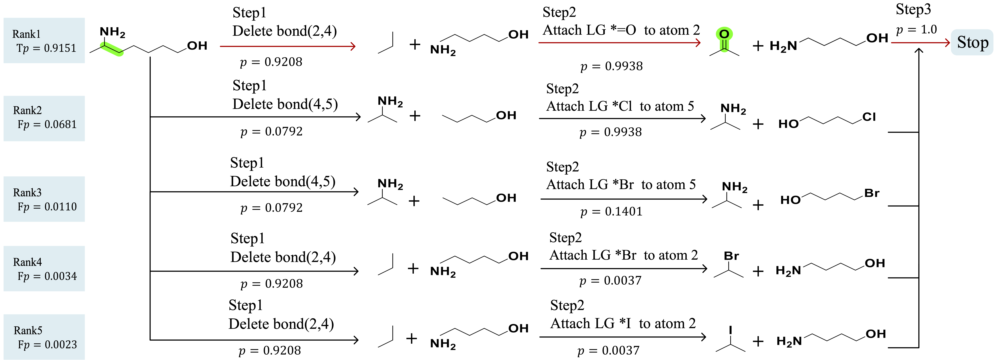

# CoEGANet
### **Co-Evolving Gated Attentive Network for Retrosynthesis Prediction**

<p align="center">
  
</p>

<p align="center">
  
  
  
  
</p>

---

## 📖 Overview

CoEGANet is a graph neural network framework for retrosynthesis prediction via molecular graph editing.

Unlike previous MPNN-based retrosynthesis models, CoEGANet explicitly enhances atom–bond interaction through an edge-aware graph attention mechanism and incorporates reaction state modeling to improve the prediction of reaction centers and edit sequences.

The proposed framework is designed to provide:

- 🔹 Rich atom–bond interaction modeling
- 🔹 Context-aware edge graph attention
- 🔹 Enhanced reaction state representation
- 🔹 End-to-end retrosynthesis prediction

---

## ✨ Highlights

- End-to-end graph editing framework for retrosynthesis prediction
- Edge-aware graph attention network (CoEGAT)
- Dynamic reaction state representation
- PyTorch implementation
- Easy-to-train and easy-to-extend framework

---

## 📂 Repository Structure

```text
CoEGANet/
│
├── configs/               # Training configurations
├── datasets/              # Dataset preprocessing
├── models/                # Model implementation
├── scripts/               # Training / evaluation scripts
├── utils/                 # Utility functions
│
├── train.py               # Model training
├── predict.py             # Inference
├── preprocess.py          # Data preprocessing
│
├── docs/                  # Figures for README
├── checkpoints/           # Saved checkpoints
├── README.md
└── requirements.txt
```

---

## ⚙️ Installation

Create a conda environment:

```bash
conda create -n coeganet python=3.9
conda activate coeganet
```

Install PyTorch:

```bash
pip install torch torchvision
```

Install dependencies:

```bash
pip install -r requirements.txt
```

---

## 📦 Dataset

The framework supports:

- USPTO-50K
- USPTO-Full

Please preprocess the dataset before training.

```bash
python preprocess.py --mode train
python preprocess.py --mode valid
python preprocess.py --mode test
```

---

## 🚀 Training

Train CoEGANet on USPTO-50K:

```bash
python train.py \
    --dataset uspto_50k
```

Example for USPTO-Full:

```bash
python train.py \
    --dataset uspto_full
```

---

## 🔬 Inference

```bash
python predict.py
```

or evaluate a trained checkpoint:

```bash
python evaluate.py
```

---

## 📈 Experimental Results

| Dataset | Top-1 | Top-3 | Top-5 |
|---------|------:|------:|------:|
| USPTO-50K | **55.4** | **78.0** | **85.0** |
| USPTO-Full | **67.9** | **88.2** | **92.6** |

> Replace the above numbers with your final experimental results.

---

## 🖼 Visualization

Example retrosynthesis prediction:

<p align="center">
  
</p>

---

## 📄 License

This project is released under the MIT License.

---

## 🙏 Acknowledgements

This project is developed based on

- PyTorch
- RDKit
- DGL

Special thanks to the open-source community.